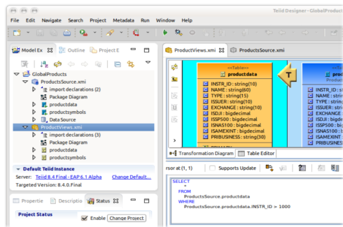

= Teiid Designer
:page-layout: features
:page-feature_id: Teiid
:page-feature_image_url: images/teiiddesigner-banner.png
:page-feature_tagline: A visual tool that enables rapid, model-driven definition, integration, management and testing of data services without programming using the Teiid runtime framework.
:page-feature_order: 4

===== *Teiid Designer is part of the JBoss Tools Integration Stack*

== What can it do?

With Teiid Designer, not only do you create source data models and map your sources to target formats using a visual tool, but you can also:

* create a virtual database (or VDB) containing your models which you deploy to Teiid server and then access your data.
* resolve semantic differences
* create virtual data structures at a physical or logical level
* use declarative interfaces to integrate, aggregate, and transform the data on its way from source to a target format which is compatible and optimized for consumption by your applications

== A modeling experience...

The Teiid Designer tool encorporates numerous features designed to present users with a rich and efficient modeling experience.

Teiid Designer supports creation and editing of the following metamodel types:

* Relational
* XML
* XML Schema (xsd)
* Web Service
* Function Definition

=== Design-time Data Preview 	
You can import metadata from your sources to create your models, and quickly preview the data. In addition you can create a Virtual Database containing your models, and perform more complex queries to test your models and data transformations.

=== Metadata Capture 	
Designer provides import capabilities that can interpret your metadata and create valid models. JDBC schema, WSDL, XML Schema (xsd) and various text formated files are some of the metadata you can import into Designer to create Relational, XML, XSD and Web Service models.

=== Data Abstraction 	
View models can be defined to represent your business domain entities, in either relational or XML format. The structures of the view models are then mapped to the underlying physical models through transformations. These transformations are defined in terms of standard SQL. It is possible to define view models in terms of other view models, so there can be multiple layers of abstraction built on top of one another. In addition, you can join data from multiple data sources in a single transformation.

== Virtual Procedures 	
Virtual procedures provide a means of defining a set of executable SQL commands. These are similar in nature to stored procedures commonly found in major relational database systems.

== So what's new with this version of Teiid Designer?

Teiid Designer 8.3 release provides additional JBoss Tools server integration as well as numerous bug fixes and a few enhancements.

* Upgrade to Modeshape 3.6 for DDL import
* Add LDAP to relational model importer
* Add support for importing Flat File via URL
* MongoDB model extension support
